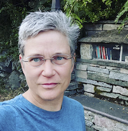

## NMFS Open Science Instructors

### Jon Peake
    

Lead Instructor  
[Website](https://peakeecology.science/) &#x2022; 
[GitHub](https://github.com/jonpeake)  &#x2022; 
[ORCID](https://orcid.org/0000-0001-5288-4184)

### Eli Holmes

[webpage](https://eeholmes.github.io/) &#x2022;  [GitHub](https://github.com/eeholmes)  &#x2022; [ORCID](https://orcid.org/0000-0001-9128-8393)

